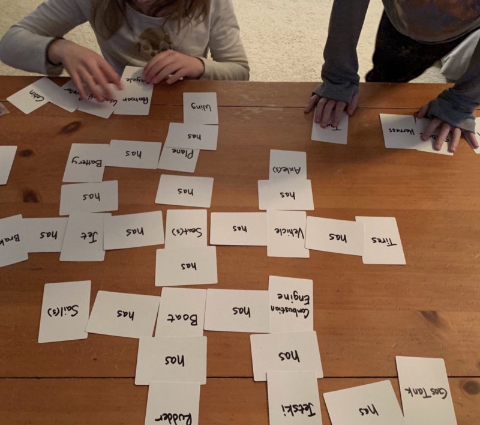

# Hour of Code Card Game

As last week’s Hour of Code wraps up I wanted to share a side project - an early prototype card game around data architecture - some colleagues and I worked on.

The early goal was to make an engaging card game around data hierarchy targeting the 5– 8-year-old demographic. When researching opportunities we used the 2017 Wisconsin Computer Science Standards report and found that teaching goals in 5–8 were:

_DA2.b.1.e: Sort objects into buckets, recognizing relevant and/or irrelevant data (e.g., one of these things is not like the other).: [2017 Wisconsin Computer Science Standards](https://dpi.wi.gov/sites/default/files/imce/computer-science/computersciencestandardsfinaladopted.pdf)_

As you can see in this earlier version, there was and still is some tweaking that’s needed around the game mechanics. We clearly over incentivized the use of “has” in our point system. Also, we’re building out ways to stack cards to push a Generic and an Instance play to open the ability to block opponents.

We also tried to move to an image based design to push a multilingual appeal, but it became increasingly hard to effectively draw, for example, a rudder without connecting it to a boat or a plane.

There is a way to go, but the idea that we can sit with a class, teach the game and then leave them decks of cards to take home and explore are exciting for us. I’m extremely proud that this project doesn’t require screen time or assumptions of access to a computer or reliable internet.

Please feel free to reach out if you love card games and have some thoughts on how we could better craft this experience. I openly admit I am a tourist in game design and openly welcome any critique.